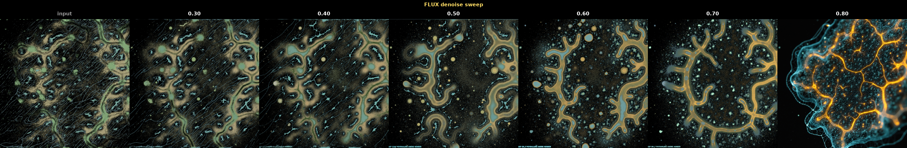
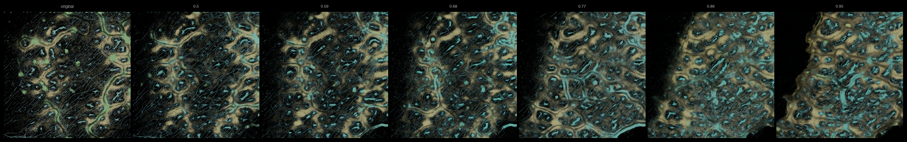
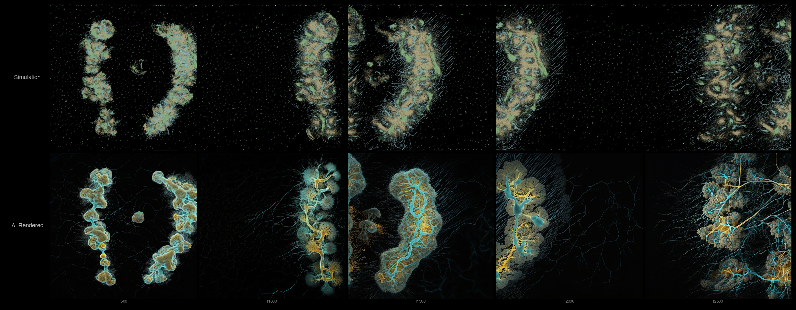
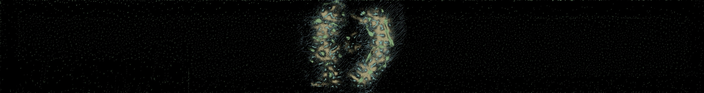
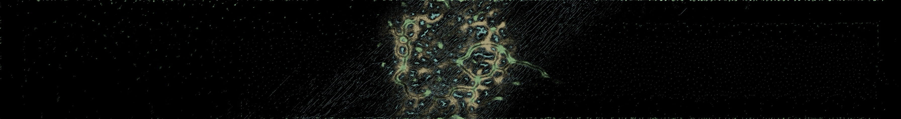
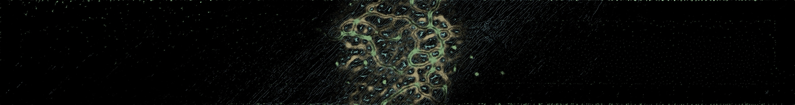

# SimAesthetics — Exploration Notes

Exploring what happens when you run artificial life simulations through custom LoRAs. Can a diffusion model reimagine simulation output as photorealistic biological matter — while preserving the spatial logic? Dark = void = entropy. Bright = structure = life.

Source: 91 ultrawide frames (14336x1920) from Unity Edge of Chaos — Physarum slime mold + Boids flocking, running on GPU compute shaders. 45,000 timesteps, sampled every 500th frame.

---

## FLUX vs SDXL — Direct Comparison

Same source frames, same prompt, tuned parameters. Three-row grid: raw simulation, SDXL v2, FLUX.

*Top: raw simulation. Middle: SDXL v2 (denoise 0.6, LoRA 0.34, cfg 6.0). Bottom: FLUX (denoise 0.75, LoRA 0.7, cfg 3.5). FLUX produces more photorealistic detail; higher LoRA strength pushes closer to the training aesthetic.*

| | SDXL v2 | FLUX |
|--|---------|------|
| Denoise | 0.6 | 0.75 |
| LoRA strength | 0.34 | 0.7 |
| CFG | 6.0 | 3.5 |
| Steps | 30 | 28 |
| Training time | ~55 min (L40S) | ~10 hrs (A100) |
| Training cost | ~$0.37 | ~$12 |
| Inference | 3080 local | A100 cloud |

Key observations:
- FLUX produces more photorealistic detail than SDXL at comparable settings
- Both models preserve structural integrity of sim frames
- FLUX needs higher denoise than SDXL for equivalent transformation (0.75 vs 0.6)
- Higher FLUX LoRA strength (0.56-0.7) pushes output closer to training aesthetic (cyan/amber glow)

---

## FLUX LoRA — Parameter Sweeps

Trained FLUX.1-dev LoRA on RunPod A100 80GB (~10 hrs, 2500 steps). Flow matching scheduler, cfg 3.5, fp8 quantization. Same 270-image dataset as SDXL.

### 2D Sweep: Denoise x LoRA Strength

*36-image matrix: denoise 0.7-0.9 (rows) x LoRA strength 0.2-0.65 (columns). Maps the full parameter space for structural fidelity vs aesthetic intensity.*

### Denoise Sweep

*FLUX img2img denoise sweep. Structure preserved across the full range. Flow matching produces smoother transitions than SDXL's DDPM — less abrupt jump between "barely changed" and "completely reimagined."*

### LoRA Strength Sweep

*Even at 0.0 (no LoRA), FLUX produces interesting results from the prompt alone. Higher values push toward the training aesthetic.*

---

## Overlay Compositing - SDXL v2

AI-rendered crops composited back onto ultrawide frames at their original coordinates. The pipeline preserves the simulation's panoramic scale while adding photorealistic texture to structure regions.

*AI crops overlaid on original ultrawide Physarum/Boids simulation frame.*

---

## SDXL v2 — Fixing Trigger Word Binding

Retrained with `caption_dropout: 0.15` (up from 0.05). The trigger word now binds strongly — `simaesthetic` alone activates the style without full descriptive captions.

### Timelapse: Dense Frames

*Dense simulation frames through SDXL v2 LoRA. Denoise 0.76 — the sweet spot for dense content where 0.6 barely changes the image.*

---

## SDXL Parameter Sweeps

Built automated sweep tooling: vary one parameter, fixed seed, labeled comparison grids.

### LoRA Strength x ControlNet Strength (2D)

*Rows: LoRA strength (0.15 to 0.5). Columns: ControlNet strength (0.5 to 1.0). Lower LoRA = more creative freedom; higher ControlNet = tighter structure lock.*

### Denoise Sweep

*Same frame at denoise 0.5 to 0.95. Denoise is content-dependent: sparse frames work at 0.6, dense frames need 0.76. Always sweep for new source material.*

---

## ControlNet — Why It's Redundant Here

Tested Canny ControlNet on sim frames. Two findings:

1. **Canny on sim frames is redundant.** The simulation IS edges — bright structures on black. Extracting edges and regenerating produces near-identical output.
2. **ControlNet txt2img fills void.** Black regions get populated with prompt-derived content. Breaks the spatial logic.

**Solution: img2img instead.** VAE Encode the sim frame, denoise 0.5-0.7. The model starts from the actual image. Black stays black. The diffusion model becomes a **selective texture synthesizer** — it only "grows" where the algorithm says there's life.

---

## SDXL LoRA v1 — First Training Run

Trained on RunPod L40S (48GB), ~55 min. Rank 16, 2500 steps, trigger word `simaesthetic`, caption_dropout 0.05.

The LoRA learned the aesthetic by step 1250 — cyan veins, amber fill, particle trails on dark backgrounds. Dog test at step 2500: clean dog, no overfitting. But the trigger word was weak — `simaesthetic` alone barely activated the style.

### Timelapse: Sparse Frames

*Top: raw Physarum/Boids simulation. Bottom: same frames through SDXL LoRA img2img. Void stays dark, structure gets organic detail.*

---

## Dataset: Cropping Ultrawide Sim Frames

270 training pairs from 91 frames. Random 1024x1024 crops from the middle 30% of horizontal space, brightness-filtered to reject void regions. Crop coordinates saved in a manifest for later overlay compositing.

Key lesson: center-cropping ultrawide = always the same region. Random sampling with a focus band = diverse views of the simulation's spatial structure.

Original ultrawide frames (14336x1920) from Unity Edge of Chaos — Physarum slime mold + Boids flocking hybrid simulation + responding to external texture of Termite sims. Original work developed for [Quantum Global Organoid Orchestra](https://merttoka.com/qGOO). 

*Frame 2000 — early simulation. Sparse structure, mostly void.*

*Frame 20000 — mid simulation. Networks forming, density increasing.*

*Frame 38000 — late simulation. Dense interconnected networks.*

---

## Open Questions

- Depth ControlNet vs Canny for organic content
- IPAdapter chained mode for style continuity across frames
- Non-sim prompts: coral reef, aerial city, mycelium grown over sim structure