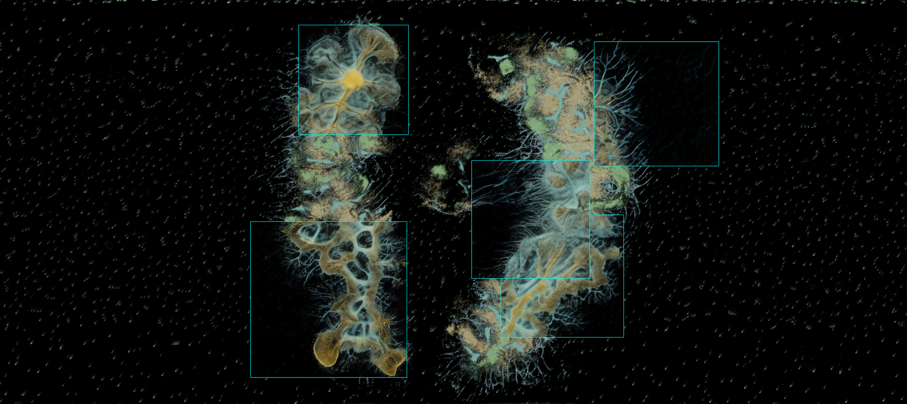

# SimAesthetics-LoRA

End-to-end pipeline: ALife simulations (Physarum + Boids) → LoRA training → ComfyUI img2img → photorealistic biological matter. Built with Unity Edge of Chaos simulation frames.


*Overlays: SDXL LoRA img2img crops composited onto ultrawide Physarum/Boids simulation frame. Background: original symbolic simulation output.*

### FLUX vs SDXL LoRA — Early Frames


*Top: raw simulation. Middle: SDXL v2 (denoise 0.6, LoRA 0.34, cfg 6.0). Bottom: FLUX (denoise 0.75, LoRA 0.7, cfg 3.5). Same dataset, same prompt. FLUX produces more photorealistic detail; higher LoRA strength pushes closer to the training aesthetic.*

## Pipeline

```
Unity Edge of Chaos (Physarum + Boids)
└── 45k frames → every 500th → 91 ultrawide (14336x1920)
         │
    prepare_dataset.py
    ├── random 1024² crops from middle 30% (h_focus=0.3)
    ├── brightness filter (min_brightness=8.0)
    └── 3 crops/frame → 270 training pairs
         │
         ▼
    ai-toolkit LoRA training
    ├── SDXL rank 16 (RunPod L40S ~55min)
    ├── FLUX rank 16 (RunPod A100 ~10hr)
    ├── trigger: "simaesthetic"
    └── caption_dropout: 0.15
         │
         ▼
    ComfyUI (Windows 3080 LAN)
    ├── img2img: VAE Encode → KSampler (denoise 0.5-0.9)
    │   └── preserves void, adds texture to structure
    ├── + LoRA (0.85-0.95): learned sim aesthetic
    └── + ControlNet (optional): structure lock at high denoise
         │
         ▼
    overlay_composite.py → AI crops back onto ultrawide → video
    make_grid.py → comparison grids (timelapse, batched, sweep)
```

### LoRA Strength × ControlNet Strength sweep

 

*Frame 10500 -- Rows: LoRA strength (0.15 → 0.5). Columns: ControlNet strength (0.5 → 1.0). Lower LoRA = more creative freedom; higher ControlNet = tighter structure lock.*


## Quick Start

```bash
# 1. Prepare dataset from sim frames
python scripts/prepare_dataset.py -i recordings/ -o datasets/sim_aesthetic/ \
  -t biomaesthetic --type physarum --crop sample --samples 3 --h-focus 0.3 --size 1024

# 2. Train LoRA on RunPod
./scripts/pod.sh sdxl upload datasets/sim_aesthetic /workspace/datasets/sim_aesthetic
./scripts/pod.sh sdxl upload scripts/train_config_sdxl_runpod.yaml /workspace/
# On pod: python run.py /workspace/train_config_sdxl_runpod.yaml
./scripts/pod.sh sdxl loras  # download checkpoints

# 3. Batch process through ComfyUI
python scripts/batch_process.py \
  -i datasets/sim_aesthetic/ -w workflows/sdxl_img2img_lora.json \
  --host http://<comfyui-host>:8188 --denoise 0.6 --limit 50

# 4. Parameter sweep
python scripts/sweep_denoise.py \
  -i datasets/sim_aesthetic/img_010.png \
  -w workflows/sdxl_img2img_lora.json \
  --host http://<comfyui-host>:8188 \
  -p 3.denoise --range 0.5,0.95,6

# 5. Comparison grid (timelapse mode)
python scripts/make_grid.py \
  -l datasets/sim_aesthetic/ -r outputs/ \
  --timelapse -m datasets/sim_aesthetic/manifest.json -o grid.png

# 6. Overlay composite back onto ultrawide (side-by-side, middle 40%)
python scripts/overlay_composite.py \
  -m datasets/sim_aesthetic/manifest.json \
  -a outputs/ -s recordings/ -o outputs/composite/ \
  --side-by-side --h-crop 0.4

# 7. Variations mode: scattered AI patches
python scripts/overlay_composite.py \
  -m datasets/sim_aesthetic/manifest.json \
  -a outputs/ -s recordings/ -o outputs/composite_var/ \
  --variations 6 --patch-range 192,512 --side-by-side
```

## Scripts


| Script                 | Purpose                                                        |
| ---------------------- | -------------------------------------------------------------- |
| `prepare_dataset.py`   | Crop + caption sim frames. Saves coordinates in manifest.json  |
| `batch_process.py`     | Send frames to ComfyUI API. `--limit`, `--denoise`, `--mode`   |
| `sweep_denoise.py`     | Parameter sweep: 1D or 2D matrix, fixed seed, labeled grid     |
| `make_grid.py`         | Comparison grids. `--timelapse`, `--count`/`--iter`, auto-wrap |
| `overlay_composite.py` | Composite AI onto ultrawides. `--side-by-side`, `--h-crop`, `--variations` |
| `flux_sample.py`       | FLUX LoRA inference via diffusers (txt2img, img2img, batch)    |
| `flux_sweep.py`        | FLUX parameter sweeps (denoise, LoRA, steps) with labeled grids |
| `comfyui_client.py`    | ComfyUI HTTP/WebSocket API client                              |
| `pod.sh`               | RunPod SSH/SCP helper (`./pod.sh <flux|sdxl> <command>`)       |


## Workflows (ComfyUI API format)


| Workflow                          | Description                       |
| --------------------------------- | --------------------------------- |
| `sdxl_img2img_lora.json`          | **Primary.** img2img + LoRA       |
| `sdxl_controlnet_lora.json`       | img2img + Canny ControlNet + LoRA |
| `sdxl_img2img.json`               | img2img baseline (no LoRA)        |
| `sdxl_controlnet_canny.json`      | ControlNet only (no LoRA)         |
| `flux_controlnet_depth_lora.json` | FLUX + Depth CN + LoRA (untested) |


UI-format versions for drag-and-drop: `ui_sdxl_img2img_lora.json`, `ui_sdxl_controlnet_lora.json`

## Key Findings

- **img2img > txt2img**: VAE Encode + denoise 0.5-0.7 preserves void. txt2img fills everything
- **Canny ControlNet redundant on sim frames**: sim IS edges. Round-tripping adds nothing
- **Denoise is content-dependent**: sparse frames → 0.6, dense frames → 0.76
- **Trigger word needs aggressive caption dropout**: 0.05 too low, retrained with 0.15
- **LoRA strength sweet spot**: 0.85-0.95. Below 0.8 barely visible, above 1.0 artifacts

## Training


| Config                          | Target          | Hardware         | Time   | Status   |
| ------------------------------- | --------------- | ---------------- | ------ | -------- |
| `train_config_sdxl_runpod.yaml` | SDXL v2 rank 16 | RunPod L40S 48GB | ~55min | Trained  |
| `train_config_flux.yaml`        | FLUX rank 16    | RunPod A100 80GB | ~10hr  | Training |
| `train_config_sdxl.yaml`        | SDXL v1 rank 16 | Local 3080 10GB  | ~80hr  | v1 done  |


## Hardware


| Task                     | 3080 (10GB) | RunPod L40S 48GB | RunPod A100 80GB | Mac |
| ------------------------ | ----------- | ---------------- | ---------------- | --- |
| SDXL img2img             | 1024px      | —                | —                | —   |
| SDXL LoRA training       | ~80hr       | ~55min           | —                | —   |
| FLUX LoRA training       | OOM         | OOM              | ~10hr            | —   |
| Dataset prep / scripting | —           | —                | —                | Yes |


## Dependencies

- Python 3.11+, Pillow, websocket-client
- Optional: transformers+torch (captioning), playwright (frame capture)
- ComfyUI custom nodes: ComfyUI-Manager, comfyui-controlnet-aux, ComfyUI_IPAdapter_plus

